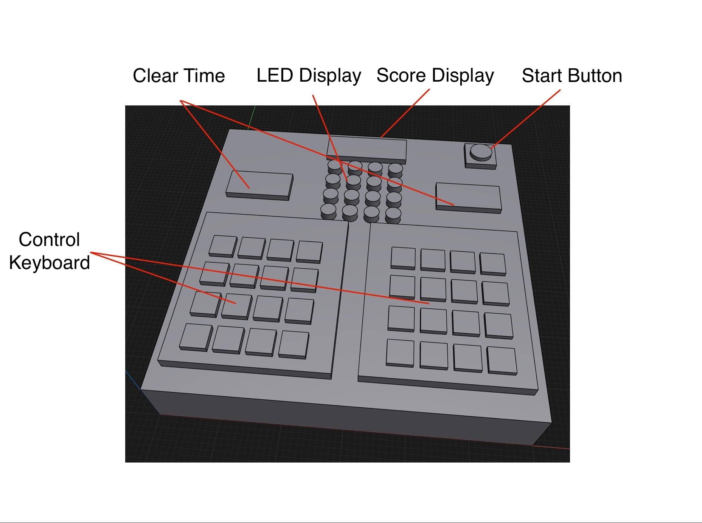

# Memory Game with 8052 Microcontroller

This project is a two-player memory game implemented using 8052 microcontrollers. The game involves four 8052 microcontrollers for handling the game logic, scoring, and LED displays. Players compete to replicate LED patterns displayed by the system within a set time, earning points for correct answers. The player with the highest score after three rounds wins.

## Project Structure

- **Circuit Diagram**  
    
  This diagram shows the complete hardware setup, including the four AT89S52 microcontrollers and connected components.

- **Model Image**  
    
  This image displays the model appearance of the project.

- **Architecture Diagram**  
    
  The architecture diagram illustrates the hardware components and their types within the project.

## Key Features

1. **Button Start**  
   Pressing the button resets the score and starts a new game round.

2. **First AT89S52 (Player Score)**  
   - Controls score reset and game start.
   - Receives signals from the AT89S52s monitoring both players to update the scores on the display.

3. **Second AT89S52 (Player 1 Input)**  
   - Monitors Player 1's keypad input.
   - Sends a signal to the first AT89S52 if Player 1's input is correct, updating the scoreboard.

4. **Third AT89S52 (Player 2 Input)**  
   - Monitors Player 2's keypad input.
   - Sends a signal to the first AT89S52 if Player 2's input is correct, updating the scoreboard.

5. **Fourth AT89S52 (LED Display)**  
   - Controls the LED pattern display.
   - Manages the countdown timer on the seven-segment display.

## How to Play

1. **Game Start and LED Pattern Display**  
   After pressing the button, 8 out of 16 LEDs will flash randomly, creating a pattern that players must replicate. Once the pattern is displayed, the seven-segment display will begin a 9-second countdown.  
     
   

2. **Player Input**  
   Players 1 and 2 have 9 seconds to input the observed LED pattern using their respective keypads. Correct input within the time frame earns a point, and the countdown stops; otherwise, the player's score remains unchanged.  
     
   

3. **End of Game and Score Display**  
   After three rounds, the player with the higher score wins, and their seven-segment display will fully illuminate. If both players have equal scores or no points, both displays will fully illuminate to indicate a draw.  
     
   

---
